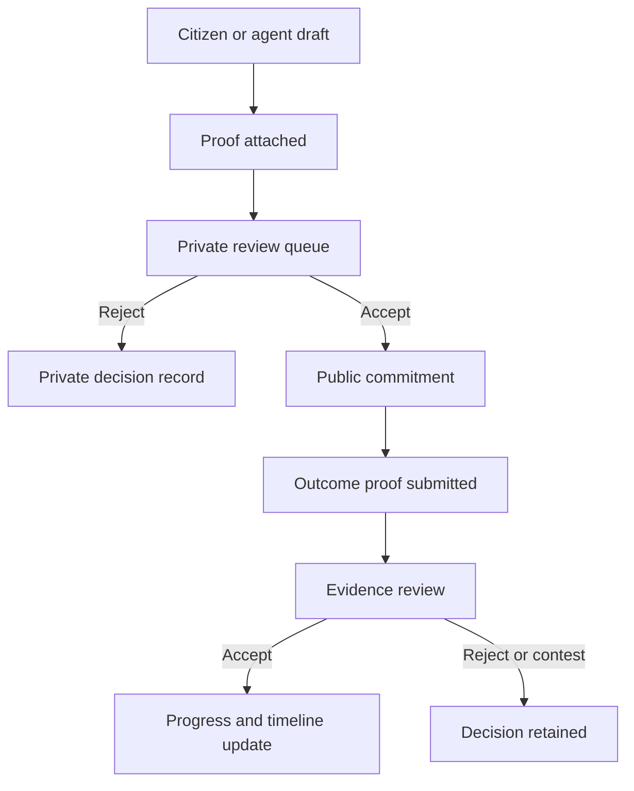
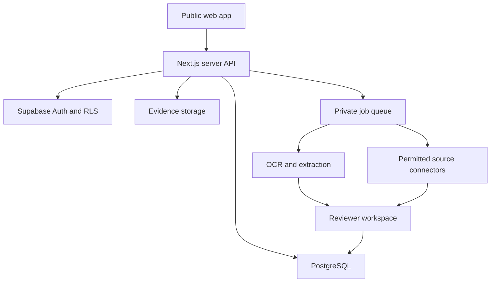

# Vaada — Master Product Requirements & Production Architecture

**Version:** 0.1 design checkpoint  
**Date:** 23 August 2026  
**Status:** Full-stack implementation baseline completed; production data, provider credentials, security review, and launch approval remain required.  
**Working name:** Vaada  
**One-line definition:** A source-backed public register that records public promises, preserves the proof that they were made, and tracks verified evidence of progress over time.

---

## 0. Delivery boundary

This document is the contract for the rebuild. The repository now contains the public register and details, Supabase schema and row-level policies, anonymous citizen sessions, optional sign-in, submission and review flows, server-side extraction, private ingestion candidates, and a companion Expo app. Production launch still requires a real Supabase project, private provider credentials, reviewed seed data, legal/editorial ownership, security testing, and store/deployment configuration.

---

## 1. Product thesis

Public promises are scattered across speeches, social posts, news reports, meeting minutes, government orders, videos, and local documents. They are easy to announce and difficult for an ordinary resident to find later. Existing grievance systems often show whether a case was processed, not whether the underlying promise was visibly delivered.

Vaada creates a durable public memory of what was promised, who or which office owns the commitment, where it applies, when it was made, the exact stated deadline or absence of one, the original proof, accepted evidence of progress or non-delivery, and editorial decisions and corrections over time.

### Product promise

Within 30 seconds, a reader should understand the current state of a commitment. Within two taps, a skeptical reader should reach the primary source and full evidence history.

### Core principle

Vaada is an evidence register, not an accusation engine. It records statements and reviewed evidence. It does not automatically decide that a person lied, failed, or acted in bad faith.

---

## 2. Users, jobs, and success moments

| User | Primary job | Success moment |
| --- | --- | --- |
| Resident | Find what was promised for my area | Sees status, deadline, progress, and source without understanding government terminology |
| Citizen contributor | Put a promise on record | Submits a link or image with minimal typing and gets a trackable receipt |
| Volunteer | Add a local update | Uploads evidence without changing public facts directly |
| Journalist/researcher | Verify and analyze a claim | Downloads sourceable facts and follows complete provenance |
| Public authority | Correct or document the record | Submits an official response through the same review process |
| Reviewer | Protect accuracy | Compares source, draft, duplicates, geography, and evidence before publishing |
| Editor/admin | Operate the register | Audits changes, handles corrections, manages reviewers, and monitors abuse |

### Non-goals

- Not a social network, petition platform, electoral prediction tool, rumor board, or general complaint-resolution portal.
- No scraped named-person claims without human review.
- No inferred private contact information.
- An announcement, tender, or foundation-stone event is not completion proof by itself.
- No password required before a citizen can contribute.

---

## 3. Trust constitution — non-negotiable rules

1. Every public commitment has at least one accepted receipt showing that the promise was made.
2. Automatic systems write only private review candidates; they never publish a commitment.
3. AI output is labelled as a draft until a human accepts it.
4. A missing deadline remains missing. Never invent one.
5. Progress changes only after an evidence review decision.
6. Describe a passed deadline factually, without moral judgement.
7. Status is never communicated through color alone.
8. Public edits are versioned; corrections never silently rewrite history.
9. Rejected submissions stay private with a reason and audit event.
10. Named people appear only when the source supports the attribution.
11. Announcements can prove a promise exists but do not prove delivery.
12. Uploaded evidence may become public only after a clear warning and privacy review.
13. Sensitive details involving children, phone numbers, addresses, identity documents, or medical information require redaction or rejection.
14. Watcher emails and official contacts are private and inaccessible to public clients.
15. Every moderation action records actor, time, before-state, after-state, and reason.

---

## 4. Scope

### MVP

- Public homepage and searchable promise register.
- State, district, authority, category, status, and deadline filters.
- Canonical detail page per commitment.
- Anonymous-first submission from URL, text, image, or PDF.
- AI-assisted extraction into editable fields.
- “My logs” for the current anonymous identity.
- Private account-based reviewer workspace.
- Receipt and outcome-proof review.
- Progress/timeline updates and correction/redaction intake.
- Reviewed seed dataset, SEO metadata, sitemap, robots rules, and methodology page.

### Post-MVP

- Permitted feed ingestion and scheduled discovery.
- Multilingual UI and extraction.
- Double-opt-in promise watching.
- Research export/API and organization workflows.
- Source link-rot checks, archival integration, and verified authority responses.

### Explicitly deferred

- Autonomous public publishing.
- Unlicensed X/Twitter scraping.
- Public comments, voting, likes, or popularity ranking.
- Automated accusation or credibility scores for individuals.
- Bulk authority email before verified contacts, unsubscribe, editorial approval, and incident response exist.

---

## 5. Information architecture

### Public routes

| Route | Purpose |
| --- | --- |
| `/` | Overview, search entry, latest records, states, trust method |
| `/promises` | Searchable/filterable register |
| `/promises/[slug]` | Promise, receipts, proof timeline, corrections |
| `/states/[state]` | State roll-up and district navigation |
| `/states/[state]/[district]` | District register |
| `/authorities/[slug]` | Office roll-up with sample-size warning |
| `/categories/[slug]` | Category register |
| `/methodology` | Status, evidence, review, correction, ranking definitions |
| `/editorial-policy` | Editorial safeguards and conflict policy |
| `/corrections` | Correction/redaction path |
| `/about` | Mission, ownership, funding, and contact |

### Contribution routes

| Route | Purpose |
| --- | --- |
| `/submit` | Link/upload-first intake |
| `/submit/review` | Confirm AI-extracted drafts |
| `/proof/new?promise=` | Add outcome evidence |
| `/my-logs` | Current identity’s submissions |

### Private routes

| Route | Purpose |
| --- | --- |
| `/review` | Queue summary |
| `/review/submissions/[id]` | Source and publish decision |
| `/review/proofs/[id]` | Outcome-proof decision |
| `/review/candidates/[id]` | Automated discovery candidate |
| `/review/corrections/[id]` | Correction/redaction case |
| `/admin/reviewers` | Roles and MFA posture |
| `/admin/audit` | Immutable audit explorer |

Private routes use server authorization, `noindex`, `noarchive`, `no-store`, and generic not-found behavior for unauthorized access.

---

## 6. Mobile-first public experience

### First viewport

The first phone viewport communicates that Vaada records public promises and proof, lets the user explore or contribute, is human-reviewed and source-backed, and requires no account to begin.

### Promise feed card

- short title;
- state and district/locality;
- plain-language status;
- responsible office/person where supported;
- promised date;
- stated deadline or “No deadline stated”;
- accepted source count;
- verified progress percentage and accessible label;
- last reviewed update;
- “Open full record” action.

The detail route then presents summary; status/deadline/progress; exact wording; responsible party; “Why this status?”; receipt; chronological outcome evidence; geography; audit/correction history; and contribution actions.

### Low-friction contribution

The intake begins with **“What proof do you have?”** The user pastes a URL, uploads an image/PDF, or pastes text. The system extracts fields and asks the contributor to correct a short summary. Geography is free-text first with suggestions, not a rigid cascading form. Name and email remain optional.

---

## 7. Visual system

The direction is inspired by the Auxia reference but must remain a distinct Vaada identity.

| Token | Value | Use |
| --- | --- | --- |
| Graphite | `#1F2A2C` | Primary text, dark canvas, and records |
| Cool white | `#F3F6F5` | Main canvas and light type on graphite |
| Emerald | `#30B89A` | Scroll spine, primary actions, and selected states |
| Graphite depth | `#111819` | Tonal extension for dark cards and footer |
| Slate | `#6F837E` | Review/warning state, always paired with text |
| Soft green | `#69B58C` | Fulfilled semantic state, always paired with text |

Typography uses Manrope Variable as a licensed open alternative to proprietary PP Neue Montreal, and IBM Plex Mono for labels/data. Motion uses Lenis, an emerald vertical evidence spine that fills with scroll, restrained entrance/progress animation, and a reduced-motion mode. Automatic promise cards expose a pause/play control and stop after direct interaction. No scroll-jacking, cursor replacement, or motion required to understand content.

---

## 8. Promise lifecycle and states



Stored commitment status: `unanswered | promised | in_progress | fulfilled | broken | disputed`.

Derived urgency: `kept | fresh | soon | urgent | critical | broken | disputed | undated | unanswered`.

Precedence is fulfilled, disputed, unanswered, missing deadline, passed deadline, then remaining time-window bands. All calculations receive one request-scoped `now`; domain functions never call `Date.now()` internally.

Progress is an integer 0–100, changes only in a reviewer transaction, remains independent from deadline timing, and shows completion date rather than a countdown when fulfilled.

---

## 9. Evidence model

A **receipt** proves the commitment was made. An **outcome proof** supports or refutes delivery. Verdicts are `pending | verified | rejected | contested`.

Evidence strength is server-derived:

1. `signed_document` — signed document plus preserved media;
2. `media` — uploaded original image/document;
3. `document_link` — official written-order link;
4. `press_link` — attributable press report;
5. `link_only` — other safe public HTTP(S) link;
6. `none` — invalid for a promise submission.

---

## 10. Production system architecture

### Stack

- Next.js App Router + TypeScript.
- Supabase PostgreSQL, anonymous auth, reviewer auth, Storage, and RLS.
- Server route handlers/actions for privileged mutations.
- Zod at all boundaries.
- Background jobs for permitted ingestion, OCR/extraction, alerts, and link checks.
- Provider-abstracted LLM service; no direct provider calls from the browser.
- Structured logs, error monitoring, CDN/WAF rate controls, and a controlled mail provider after double opt-in.



### Module boundaries

```text
src/app                  routes and metadata
src/components           presentation/accessibility
src/domain               pure status, evidence, ranking, deadline logic
src/server/repositories  database access
src/server/services      submissions, review, audit, publishing
src/server/ai            OCR, extraction, normalization, confidence
src/server/ingest        permitted adapters and fingerprinting
src/server/security      authz, rate limits, URL/file validation
src/server/observability logs, metrics, tracing
supabase                 schema, policies, tests, seed
tests                    unit, API, RLS, browser
```

Web/API and Supabase deploy separately with isolated preview/production credentials. Uploads use constrained direct object transfer. Cron routes fail closed when secrets are missing. Preview disables mail and authority alerts.

---

## 11. Data model

| Entity | Visibility | Purpose |
| --- | --- | --- |
| `commitments` | Public accepted rows | Canonical promise |
| `receipts` | Public after acceptance | Proof promise was made |
| `proofs` | Public after decision | Outcome evidence |
| `submissions` | Owner/reviewer | Citizen queue |
| `submission_drafts` | Owner/reviewer | Editable extracted units |
| `ingest_candidates` | Reviewer | Automated discovery |
| `authorities` | Public | Normalized office/person |
| `geographies` | Public | Place hierarchy |
| `timeline_events` | Public where safe | Status/evidence/correction history |
| `review_decisions` | Reviewer/public projection | Moderation provenance |
| `correction_cases` | Mixed | Correction/redaction |
| `watchers`, `alerts` | Private | Consent and delivery audit |
| `audit_events` | Admin | Immutable actor/action history |

Commitment fields include identity/slug, title/detail, category/status/progress, weight/beneficiaries, promise date, deadline and exact wording, geography, accountable party, demand source, timestamps, and publication time.

### Constraints

- deadline and label both present or both null;
- progress 0–100 and weight 1–5;
- UDISE exactly 11 digits and pincode exactly six digits when present;
- every accepted commitment has an accepted receipt;
- submission has HTTP(S) source or uploaded evidence;
- user identity defaults to `auth.uid()` in SQL;
- deleting auth user does not delete accepted public evidence;
- public clients cannot write status, progress, verdict, reviewer, or audit fields.

Indexes cover geography/status, non-null deadline, search text, source fingerprint, unique watcher/alert, review queue age, and commitment evidence.

---

## 12. Authentication and authorization

Citizen contribution starts a Supabase anonymous session. No password is requested. Optional name/email does not promise recovery. The app explains that clearing browser data loses anonymous My Logs access unless a future email-link upgrade is implemented.

Reviewers use real verified accounts, roles, server authorization, and MFA in production. No reusable token appears in a URL.

| Resource | Public | Contributor | Reviewer service path |
| --- | --- | --- | --- |
| Accepted commitments | Read | Read | Transactional create/update |
| Own queued submission | No | Read/edit/withdraw allowed columns | Read/decide |
| Other submissions | No | No | Read/decide |
| Pending proof | No | Read own | Read/decide |
| Accepted proof/receipt | Safe read projection | Read | Publish/correct |
| Watchers/alerts/candidates/audit | No | No | Authorized server only |

---

## 13. AI extraction and ingestion

### Assisted extraction flow

1. Receive URL, image, PDF, or text.
2. Validate MIME, size, URL scheme, redirects, and identity limit.
3. Store immutable original input.
4. Extract text through safe fetch, OCR, or document parser.
5. Detect language and preserve original text.
6. Produce one or more structured drafts.
7. Flag low-confidence/missing fields.
8. Show editable draft to contributor.
9. Require explicit confirmation.
10. Store queued submission only.

Extract exact quote, short title, speaker/office/department, promise date, deadline phrase/normalized date, state/district/locality, category, quantities/beneficiaries, source metadata, per-field confidence, and ambiguity warnings.

Sources are untrusted input, never instructions. Block private networks and unsafe URL schemes. Limit redirects, size, and time. Never infer unscoped districts, never treat model confidence as evidence strength, preserve model/prompt versions for evaluation, and avoid unnecessary personal data in prompts/logs.

Scheduled discovery uses only permitted feeds, licensed APIs, government publications, or legally usable sources. X/Twitter is user-supplied or licensed—never unauthenticated scraping. It writes candidates only.

### Pre-launch AI quality targets

- Promise detection precision ≥ 90%.
- Deadline normalization precision ≥ 95%; abstain rather than invent.
- State accuracy ≥ 98%; district measured only when state is known.
- Named accountable party precision ≥ 95%.
- Zero automatic public writes in integration tests.

---

## 14. API contracts

| Endpoint | Method | Authorization | Result |
| --- | --- | --- | --- |
| `/api/extract` | POST | Anonymous/user + rate limit | Private draft |
| `/api/uploads/sign` | POST | Anonymous/user | Constrained upload intent |
| `/api/submissions` | POST | Anonymous/user | Queued submission |
| `/api/submissions/[id]` | PATCH | Queued owner | Allowed draft fields |
| `/api/submissions/[id]/withdraw` | POST | Queued owner | Withdrawal + audit |
| `/api/proofs` | POST | Anonymous/user | Pending proof |
| `/api/corrections` | POST | Public rate limit | Open case |
| `/api/watch` | POST | Public rate limit | Unconfirmed watcher |
| reviewer server action | POST | Reviewer | Atomic decision |
| `/api/cron/ingest` | POST | Cron bearer | Candidates only |
| `/api/cron/alerts` | POST | Cron bearer + flags | Alert audit |

All public writes validate object JSON, body size, field length, URL scheme, identity, rate limit, and proof. Errors never expose stack traces, SQL, tokens, service keys, user emails, or queue existence.

---

## 15. Review and publication

The reviewer sees the original source beside extracted and edited text, geography, authority, tier, duplicate candidates, privacy flags, notes, and exact public preview.

Atomic accept re-authorizes reviewer, locks or uniquely keys the decision, validates queued state and source, creates commitment/receipts/timeline/audit, connects duplicates, marks accepted, and returns canonical URLs. Retries and double clicks cannot duplicate publication.

Accepted outcome proof creates verdict, timeline event, optional progress/status update, and audit event in one transaction. Any progress number requires evidence-linked reasoning.

---

## 16. Security, privacy, and abuse

### Uploads

- JPEG, PNG, WebP, HEIC, PDF; 5 MB initial cap.
- Anonymous/authenticated session required.
- Generated safe object key; original filename is metadata only.
- Signature verification, malware scan, safe image re-encoding.
- No contributor overwrite/delete after upload.
- Responsive lazy thumbnails; full media only on demand.

### URL fetch

- HTTP(S) only.
- Block loopback, private, link-local, metadata, and reserved IPs after resolution and redirects.
- Limit redirects, response size, and time; send no platform cookies or credentials.

### Rate limits

Layer CDN/WAF, Supabase auth, per-identity DB limits, lower no-session limits, object limits, and adaptive CAPTCHA only after suspicious patterns. Starting hourly identity limits: submissions 20, proofs 30, complaints 15, receipts 30, uploads 60.

### Privacy operations

Provide an upload warning, redaction request SLA, emergency takedown path, retention policy, encrypted operational contacts, and documented processors/model data use. Never log auth tokens or signed media URLs.

---

## 17. Search, rankings, and numbers

Search title, location, authority, source quote, category, and identifiers with state-scoped place matching. Every headline statistic defines numerator, denominator, reviewed sample size, date range, inclusion rules, and refresh time. Authority/state rankings show sample size and suppress small samples. Score and confidence remain separate.

Public CSV/JSON export is post-MVP, rate limited, privacy reviewed, licensed, and based on the canonical public projection.

---

## 18. Accessibility, localization, and performance

### Accessibility

- WCAG 2.2 AA target, landmarks/headings, visible focus, 44×44 targets.
- Accessible names for progress/menu/filters/media.
- Text/icon plus color for status; no hover-only information.
- Reduced motion and clear error summaries.

### Localization

Architecture supports English, Hindi, and a launch-state language. Preserve original source language; label machine translation. Use unambiguous dates, searchable transliteration, and regional place aliases.

### Performance budgets

- Mobile FCP < 2.0 s target; LCP < 2.5 s p75; INP < 200 ms p75; CLS < 0.1.
- Homepage initial JS target < 180 KB gzipped after baseline review.
- Evidence media excluded from initial load.
- No horizontal overflow at 320 px.

---

## 19. SEO and discoverability

Canonical metadata for all public surfaces; dynamic sitemap; robots exclusion for API/review/admin/My Logs; `llms.txt`; valid Organization, WebSite, Dataset, and FAQPage structured data; no ClaimReview without editorial/legal eligibility; factual per-commitment share metadata; monitored source-link rot.

---

## 20. Observability and service targets

Dashboards track request latency/errors, submission/upload success, anonymous auth, extraction latency/cost/accuracy, queue age, moderation throughput, privacy flags, duplicates, link rot, cron/alert outcomes, and 429 patterns.

Initial objectives: 99.9% public availability after stabilization, read API p95 < 800 ms from target region, submission acknowledgment < 5 s excluding transfer, AI draft p95 < 45 s with asynchronous status, critical privacy acknowledgment < 24 hours. Do not promise a review SLA without staffed reviewers.

Incident classes: P0 private-data/service-key leak or mass incorrect publication; P1 unauthorized moderation/corrupt updates; P2 degraded search/extraction/filters; P3 cosmetic/accessibility regression without task loss.

---

## 21. Testing and launch gates

### Unit

Status precedence, deadline/Hinglish parser, pure clock handling, progress semantics, state-scoped district resolver, SSRF validator, evidence tiers, ranking/sample guards.

### Database/RLS

Cross-user isolation; queued-owner column limits; SQL proof requirement; no public status/progress/verdict writes; accepted immutability; upload policies; idempotent acceptance.

### API

Safe URL/upload submission; malformed/huge/unsafe input; cron fail-closed; generic errors; redirect/DNS-rebinding SSRF tests.

### Browser

Phone URL→draft→edit→submit→My Logs, upload flow, reviewer acceptance/publication, queued edit/withdraw rules, evidence/correction path, keyboard/screen-reader smoke, 320 px overflow, hydration/secret checks.

### Manual production gate

Secret/history scan, non-production Supabase E2E, seed re-review, staffed privacy contact, reviewer MFA, backup restore drill, legal/editorial pages, and authority alerts disabled.

---

## 22. Delivery plan using the ECC loop

Use ECC’s engineering principle—**plan → test → implement → review → verify → remember → improve**—without bundling ECC into the public runtime.

| Phase | Deliverable | Exit gate |
| --- | --- | --- |
| 0 | Product/editorial/source/privacy policy | Approval; 10+ reviewed fixtures |
| 1 | Supabase schema/auth/storage/RLS | Privilege-bypass tests pass |
| 2 | Pure domain engine/repositories | Status/date/evidence/ranking tests pass |
| 3 | Anonymous intake/upload/AI/My Logs | Phone E2E and negative paths pass |
| 4 | Reviewer queue/atomic publication/audit | Accept/reject/idempotency pass |
| 5 | Full public IA/approved visual system | Phone usability/accessibility pass |
| 6 | Permitted ingestion/notifications | Candidate-only proof and consent pass |
| 7 | SEO/WAF/monitoring/backups/runbooks | Security and launch gate pass |

The present checkpoint is only the homepage visual slice. It is not evidence that later phases exist.

---

## 23. Risk register

| Risk | Impact | Mitigation |
| --- | --- | --- |
| Defamation/inaccurate attribution | Severe | Primary sources, neutral wording, correction/legal policy |
| AI hallucinated date/person/place | Severe | Confidence, abstention, side-by-side source, human acceptance |
| Reviewer bias/capture | High | Conflict policy, dual sensitive review, audit, methodology |
| Coordinated spam | High | Proof, limits, queue isolation, fingerprints |
| Sensitive document exposure | Severe | Warning, private queue, redaction, takedown |
| Understaffed review | High | Narrow geography, queue dashboard, no false SLA |
| Invented-looking progress | High | Evidence-linked rationale and timeline |
| Source link rot | Medium | Lawful archive/copy, checks, citation metadata |
| OCR/LLM cost spike | Medium | Async queue, caps, cache, cheap classifier, quotas |
| Mobile form abandonment | High | Link/upload-first, editable draft, optional identity |
| Misleading public numbers | High | Definitions, sample, refresh date, suppression |

---

## 24. Blunt decisions required

1. **Who is legally and editorially responsible for Vaada?**
2. **Who reviews the first 100 submissions, and how quickly?** If nobody, launch curated and keep public intake closed.
3. **What is the launch geography?** “All India” without language/reviewer coverage is not credible.
4. **Which languages ship on day one?**
5. **Named politicians, or only accountable offices unless attribution is exceptionally clear?**
6. **Which sources are admissible: official only, or tiered press/video/social evidence?**
7. **May Vaada preserve third-party documents/screenshots, or link only until legal policy exists?**
8. **What counts as progress by category?** Sanction, tender, start, completion, commissioning require definitions.
9. **Must every progress percentage include a calculation note?** Recommended: yes.
10. **Will authorities have a verified response channel at launch?**
11. **Who staffs correction/takedown and what is the operating SLA?**
12. **What funding/independence disclosure will be public?**
13. **Do contributors need cross-device recovery?**
14. **Which OCR/LLM providers and data regions are acceptable?**
15. **What budget is acceptable at 10k, 100k, and 1M monthly visitors?**
16. **Will the public dataset have an open license?**
17. **Will all existing 34 records be re-verified before launch?** Recommended: mandatory.
18. **Is Vaada the final name and is the prototype V wordmark acceptable for now?**

---

## 25. Design approval checklist

- dark ink / warm paper / cobalt direction;
- scroll-filled evidence spine;
- oversized non-scrolling number blocks;
- short promise summaries with evidence-linked detail pages;
- state tiles as geography navigation;
- Manrope + IBM Plex Mono;
- one-column mobile promise feed;
- neutral language and human-review message;
- prototype wordmark;
- homepage information order.

Approval accepts the direction, not final production polish. Contrast, content, accessibility, performance, and exact components remain subject to testing.

---

## 26. Research basis

- The supplied rebuild PRD defines the trust model, security posture, data semantics, tests, and existing seed notes.
- Auxia supplied high-level visual motifs: dark/paper alternation, cobalt accent, editorial metrics, mono microcopy, full-height rhythm, and oversized footer typography. Vaada’s composition is original and does not copy proprietary font assets or business content.
- ECC supplied the production loop and review discipline. It is an engineering harness/toolbox, not the product framework.

